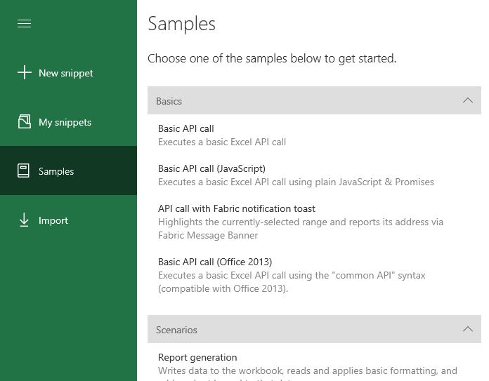

[](https://travis-ci.com/OfficeDev/office-js-snippets)

# Office JS Snippets
A collection of code snippets built with [Script Lab](github.com/OfficeDev/script-lab)




## To contribute:
- [Fork](https://help.github.com/articles/about-forks/) this project into your GitHub account and [create a branch](https://help.github.com/articles/creating-and-deleting-branches-within-your-repository/) for the set of snippets that you'd like to submit.
- Add samples using the instructions below.
- Submit a [pull request](https://help.github.com/articles/about-pull-requests/) from your branch to the `master` branch of this repository.


## Folder Structure
- All snippets must be inside the samples folder.
- The `base folders` such as Excel, Word etc. are all the various broad-level categories.
- Inside of each `base folder`, there are `group folders` for the group in which a sample belongs to.
- Inside of each `group folder`, there are `.yaml` which represent a snippet.


## Adding a new sample

Adding a new sample can be done via the website...but if you want a variety of auto-completions to ensure that your sample doesn't fail the build:

1. Fork the snippets repo, and then clone it. Alternatively, if you have repo permissions, you may create a branch within the snippets repo.
2. Ensure you have a recent build of Node [6.10+] (`node -v`). Then install `yarn` as a global package `npm install yarn --global`.
3. Run `yarn install` (similar to `npm install`, but better; and that's what is used by Travis, so best to have the same environment in both places)
4. Create a snippet using [Script Lab](https://github.com/OfficeDev/script-lab/blob/master/README.md#what-is).  Ensure that the name and description are what you want them to be shown publicly.
5. Choose the Share icon, and then choose **Copy to Clipboard**. 
6. Open the folder where you want to store your code sample, and create a .yaml file. Paste your code sample into that file. Ensure that the code sample file names and folder names are in [`kebab-case`](http://wiki.c2.com/?KebabCase). To order folders and code samples:
    - To order folders in a particular way, add a numeric prefix to the folder name (for example, "03-range"). The folder will be ordered sequentially in the list, and the prefix ("03-") will be removed.
    - To order code samples in a particular folder, add **order: <#>** at the top of the code sample file(s). Code samples with order numbers will be sorted relative to the order specified.
7. Stage the change:
    1. Open the office-js-snippets project in Visual Studio Code.
    2. Open the Source Control tab in VS Code. Your new YAML file will be listed in the **Source Control** pane just to the right of the tabs.
    3. Right-click the file name and select **Stage Changes**. Leave VS Code open.
10. Run `npm start`. If you received warnings, review the output to check what caused the build validation to fail, and fix as needed. As part of your troubleshooting, you can see what changes `npm start` made to the file:
    1. In VS Code, you will see that Source Control pane now has two sections: **Staged Changes** and **Changes**, with your file listed under both.
    2. Right-click the file name under **Changes** and select **Open changes**. Both versions of the file will be open in the editor so you can see the pending changes relative to the staged version. You may find that the script already substituted in required fields like `id` or `api_set` with reasonable defaults. 
12. Re-run `npm start`, and fix errors, until the build succeeds. 
13. Submit to the repo, and create a merge request into master.


## Style guidelines:

Basic snippet structure is as follows:

```ts
$("#run").click(run);

async function run() {
    try {
        await Word.run(async (context) => {
            const range = context.document.getSelection();
            range.font.color = "red";

            await context.sync();
        });
    }
    catch (error) {
        OfficeHelpers.UI.notify(error);
        OfficeHelpers.Utilities.log(error);
    }
}
```

A few style rules to observe:

* Each button-click handler should have its own `async` function, called "run" if there is only one button on the page -- otherwise, name it as you will.
* Inside the function there shall be a try/catch.  In it you will await the `Excel.run` or `Word.run`, and use `async/await` inside of the `.run` as well.
* All HTML IDs should be `all-lower-case-and-hyphenated`.
* Unless you are explicitly showing pretty UI, I wouldn't do the popup notification except for one or two samples.  It's a lot of HTML & JS code, and it's also not strictly Fabric-y (there is a more "correct" way of doing this with components).
* Strings should be in double-quotes.
* Don't forget the semicolons.
* `Libraries` in snippets must have a specific version. Eg. `jquery@3.1.1`.


## Branches

When a snippet is commited into the `master` branch, a Travis-CI build process kicks off to validate the build.  If successful, it  commits the samples & playlist folders into a `deploy-beta` branch, which is used for local and "edge" testing.  For production, a the `prod` and `deploy-prod` branches are used, instead.


## Debugging the build script

* The scripts for building/validating the snippets are under the `config` folder -- in particular, under `build.ts`. There is also a `deploy.ts` for copying the built files to their final location.)

>> **NOTE**: If debugging in Visual Studio Code, you can use "F5" to attach the debugger, but be sure to run `npm run tsc` before you do (and after any code change!). `F5` is not set to recompile!
