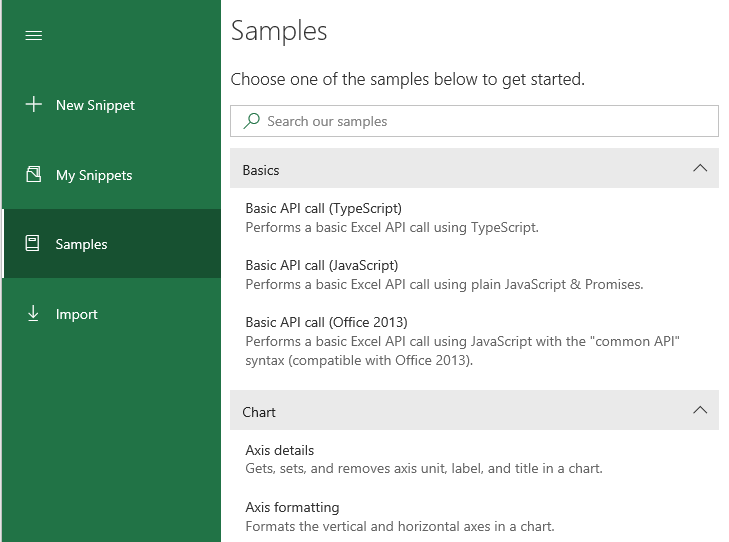

# Office JS Snippets

A collection of code snippets built with [Script Lab](//github.com/OfficeDev/script-lab)



## To contribute:

> **Note**: For all command line interface (CLI) commands mentioned in these instructions, you can use either Git Bash or a Node Command Prompt.

### One-time tasks

1. [Fork](https://help.github.com/articles/about-forks/) this project into your GitHub account.
1. Clone your fork to your development computer.
1. Ensure that you have Node, version 6.10+, installed. (To check the version run the command `node -v`.)
1. Install `yarn` as a global package `npm install yarn --global`.
1. Be sure your CLI is in the root of the office-js-snippets repo and run `yarn install`. (It is similar to `npm install`.)
1. Set up the original \OfficeDev\office-js-snippets as the upstream repo for your local repo by following the steps in [Configuring a remote for a fork](https://help.github.com/articles/configuring-a-remote-for-a-fork/).
1. If you'll be using Visual Studio Code as your editor, install the [TSLint](https://marketplace.visualstudio.com/items?itemName=eg2.tslint) extension for Visual Studio Code.

### Adding a new sample

> For the git tasks in this procedure, the instructions assume that you're using a CLI. You are welcome to use a GUI git client. Consult the client's help to learn how to carry out the same tasks.

1. Create a snippet using [Script Lab](https://github.com/OfficeDev/script-lab/blob/master/README.md#what-is).  Ensure that the name and description are what you want to be shown publicly. Use standard TypeScript indentation. Improper indentation can cause a failure of the build that you run in a later step. See also the [**Style guidelines**](#style-guidelines) section below.
1. Choose the Share icon, and then choose **Copy to Clipboard**.
1. Paste the contents into a text editor.
1. Near the top of the file, you will see the line `api_set: {}`. This needs to be changed to specify the host API version of the most recently added API that is used in your snippet. For example, if the snippet is for Excel and it uses some APIs that were introduced in Excel API 1.3, some in 1.4, and some in 1.5, then you need to specify `ExcelApi 1.5` as the value of the `api_set` property. Put a line break and four spaces before the value and no {} characters. To continue the example, when you're done the property would look like this:

    ```yaml
    api_set:
        ExcelApi: '1.5'
    ```

1. Check the name and description property values, also near the top of the file, and edit as needed.
1. Save the file **somewhere outside of the office-js-snippets project**. (You will move it into the project in a later step.) The file name must have a ".yaml" extension and it must be in [`kebab-case`](http://wiki.c2.com/?KebabCase). For examples, see the existing *.yaml files in the subfolders of the `samples` folder of the project.
1. Make sure the main branch of your fork is in sync with the main branch of the upstream \OfficeDev\office-js-snippets repo by following the steps in [Syncing a fork](https://help.github.com/articles/syncing-a-fork/).
1. Create a new branch at the **office-js-snippets** root folder of your local repo by running the command `git checkout -b {name_of_your_new_branch}`. (This will create and checkout the new branch. *Stay in this branch for all the remaining steps.*) Each snippet should have its own branch. Suggestion: use the name of the yaml file that you created above (without the extension) as the branch name.
1. Decide the folder where your snippet should be added. All snippet files must reside within the appropriate subfolder inside the `samples` folder. Within the `samples` folder, the structure of subfolders is as follows:

    - The base folders such as `excel`, `word`, etc. primarily represent the various host applications.
    - Within each base folder, group folders organize snippets into various categories.
    - Within each group folder, each .yaml file represents a snippet.

    > **Note**: If your snippet doesn't fit with any existing group folder, create a new group folder inside the base folder. If the existing folders in the base folder begin with numbers, such as `03-range`, then your new folder should also begin with a number. Since the numbers determine the sequence of the groups in Script Lab, use a number between the numbers of the groups between which you want the new folder to appear.

1. Open one of the `.yaml` files already in the group folder. If it has an `order` property near the top, then the snippets in the group folder are ordered in a particular sequence in Script Lab. Add an `order` property to the top of your `.yaml` file and give it a number that is between the order numbers of the snippets between which you want it to appear.
1. Copy your `.yaml` file to the chosen group folder.
1. Run `yarn start`. If there are no problems, the output will end with a `Done!`. If there are errors, review the output to check what caused the build validation to fail, and fix as needed. See [**Known errors and fixes**](#known-errors-and-fixes-in-the-build-tool) for more information.

    > **Note**: The `yarn start` command adds an `id` property to the top of the file.

1. Re-run `yarn start`, and fix errors, until the build succeeds.
1. Run `git status`. You should see that, in addition to your new `.yaml` file (or possibly new folder), a `playlist\{host}.yaml` file (where `{host}` is `excel`, `word`, etc.) has also been changed. This is expected. The build tool you just ran added a reference to your new snippet to this file.
1. Run the following two commands. The commit message should be a brief description of what the snippet demonstrates; for example, `"shows how to use getWhatever method"`.

    ```
    git add -A
    git commit -m "{commit message}"
    ```

1. Push the snippet to your fork by running:

    ```
    git push --set-upstream origin {name_of_your_new_branch}
    ```

1. You now create a [pull request](https://help.github.com/articles/about-pull-requests/). In your fork on GitHub, *switch to your new branch*.
1. Choose **New pull request**.
1. On the **Open a pull request** page, verify that:

    - the base fork is `OfficeDev/office-js-snippets`
    - the base branch is `main`
    - the head fork is `{your-GitHub-account}/office-js-snippets`
    - the "compare" branch is `{name_of_your_new_branch}`.

1. The title of the pull request defaults to your commit message. Change it as needed and optionally add a comment to provide additional information about the pull request to the reviewers.
1. All pull requests to office-js-snippets must be approved by at least one reviewer. On the right side of the page is a **Reviewers** section. You can optionally suggest one or more people to review the pull request. (GitHub sometimes lists one or more admins of the repo by default, but it is not consistent in doing this.) Your pull request will be reviewed even if you don't suggest anyone.
1. Choose **Create pull request**. The page for your pull request will open. There will initially be a message on the page saying **Some checks haven’t completed yet**. An online version of the same build tool that you ran locally is testing the files again. It usually takes a few minutes.

    > **Note**: Since your pull request passed locally, it should pass the online test too. Once in a while, the online test fails when the local test passed. This is usually a bug in the online test service. If this happens, cancel the pull request, wait a few hours, and then repeat the steps for creating a pull request.

1. The reviewers may make comments on your pull request and ask you to make changes. Make changes in Script Lab and then repeat the process of creating the `.yaml` file. You do not have to create the new branch again, but make sure it is checked out when you copy the changed `.yaml` file over the previous version. After you commit and push the changed version to your fork, the new version is automatically added to your existing pull request. *Do **not** create a new pull request.*
1. When the reviewers are satisfied, your pull request will be merged to the `main` branch and the pull request will be closed.

    > **Note**: In a few days, the repo admins will merge your snippet into the `prod` branch. It will then appear in **Samples** area of Script Lab. (It is in the **My Snippets** area as soon as you create it.)

1. Optionally, you can delete the branch you created from your fork and/or your local clone.

#### Known errors and fixes in the build tool

- An error saying that `name` has upper-case letters or other disallowed characters is *not* referring to the `name` property in the file. It is referring to the file name itself. You'll also get this error, if the file extension is not `.yaml`.

## Style guidelines

Basic snippet structure is as follows:

```ts
$("#run").on("click", () => tryCatch(run));

async function run() {
    await Word.run(async (context) => {
        const range = context.document.getSelection();
        range.font.color = "blue";

        await context.sync();
    });
}

/** Default helper for invoking an action and handling errors. */
async function tryCatch(callback) {
    try {
        await callback();
    }
    catch (error) {
        OfficeHelpers.UI.notify(error);
        OfficeHelpers.Utilities.log(error);
    }
}
```

A few style rules to observe:

- Use standard TypeScript indentation.
- For each button, define a corresponding `async` function to be run when the button is clicked. The `async` function can be called "run" if there is only one button on the page -- otherwise, name it as you will.
- Each button-click handler should invoke the `tryCatch` function, passing in the name of the `async` function to be executed when the button is clicked.
- All HTML IDs should be `all-lower-case-and-hyphenated`.
- Unless you are explicitly showing pretty UI, you don't have to do the popup notification except for one or two samples.  It's a lot of HTML & JS code, and also not strictly Fabric-y (there is a more "correct" way of doing this with components).
- Strings should be in double-quotes.
- Don't forget the semicolons.
- `Libraries` in snippets must have a specific version. Eg. `jquery@3.1.1`.

## Debugging the build script

- The scripts for building/validating the snippets are under the `config` folder -- in particular, under `build.ts`.

> **Note**: If debugging in Visual Studio Code, you can use "F5" to attach the debugger, but be sure to run `npm run tsc` before you do (and after any code change!). `F5` is not set to recompile!

## Join the Microsoft 365 Developer Program

Join the [Microsoft 365 Developer Program](https://aka.ms/m365devprogram) to get resources and information to help you build solutions for the Microsoft 365 platform, including recommendations tailored to your areas of interest.

You might also qualify for a free developer subscription that's renewable for 90 days and comes configured with sample data; for details, see the [FAQ](https://learn.microsoft.com/office/developer-program/microsoft-365-developer-program-faq#who-qualifies-for-a-microsoft-365-e5-developer-subscription-).

---

This project has adopted the [Microsoft Open Source Code of Conduct](https://opensource.microsoft.com/codeofconduct/). For more information, see the [Code of Conduct FAQ](https://opensource.microsoft.com/codeofconduct/faq/) or contact [opencode@microsoft.com](mailto:opencode@microsoft.com) with any additional questions or comments.
